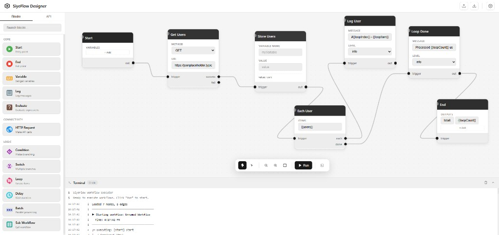
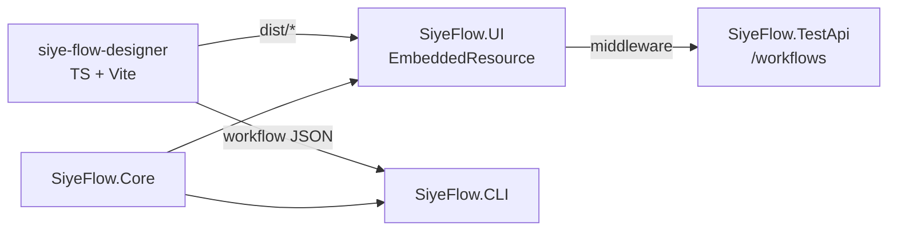

# SiyeFlow

Visual workflow designer plus an in-browser execution engine for orchestrating API calls. Design workflows in a node-edge canvas, run them in the browser, embed the designer in an ASP.NET Core API, or execute saved workflows from the .NET CLI.

## Preview



The repo contains five projects in one solution ([SiyeFlow.sln](SiyeFlow.sln)):

| Project | Path | What it does |
| --- | --- | --- |
| Designer (TS) | [src/siye-flow-designer/](src/siye-flow-designer) | Standalone Vite/TypeScript app — canvas, palette, terminal, breakpoints, browser executor |
| SiyeFlow.UI | [src/SiyeFlow.UI/](src/SiyeFlow.UI) | ASP.NET Core middleware that embeds the designer (Swagger-UI style) |
| SiyeFlow.Core | [src/SiyeFlow.Core/](src/SiyeFlow.Core) | Shared C# models + interfaces |
| SiyeFlow.CLI | [src/SiyeFlow.CLI/](src/SiyeFlow.CLI) | Command-line workflow runner |
| SiyeFlow.TestApi | [demo/api1/](demo/api1) | Demo .NET 10 web API that hosts both Swagger and the embedded designer at `/workflows` |
| SiyeFlow.Core.TypeGen | [src/SiyeFlow.Core.TypeGen/](src/SiyeFlow.Core.TypeGen) | Codegen tool (idle — emits TS enums from C# models on demand) |

## Quick start

### Standalone designer

```bash
cd src/siye-flow-designer
npm install
npm run dev
# http://localhost:3001
```

### Demo API with embedded designer

```bash
cd demo/api1
dotnet run
# Swagger:   http://localhost:5216/swagger
# Designer:  http://localhost:5216/workflows
```

### CLI

```bash
cd src/SiyeFlow.CLI
dotnet run -- execute --workflow ../siye-flow-designer/samples/1-cat-fact.json
```

## How the pieces fit



- `npm run build` in the designer outputs `dist/*` (`siye-flow-designer.{es,umd}.js`, `style.css`).
- [`src/SiyeFlow.UI/build-designer.ps1`](src/SiyeFlow.UI/build-designer.ps1) runs as a `BeforeTargets="PrepareForBuild"` step and copies `dist/*` into [`src/SiyeFlow.UI/UI/`](src/SiyeFlow.UI/UI), where the files become `EmbeddedResource` entries inside `SiyeFlow.UI.dll`.
- `SiyeFlowMiddleware` then serves them under the configured route prefix.

## Workflow schema (v2.0)

Schema source of truth: [`src/siye-flow-designer/src/models/workflow-models.ts`](src/siye-flow-designer/src/models/workflow-models.ts). Full reference in [docs/WORKFLOW_SCHEMA.md](docs/WORKFLOW_SCHEMA.md).

```json
{
  "id": "sample-cat-fact",
  "name": "Cat Fact API",
  "version": "2.0.0",
  "nodes": [
    { "id": "start_1", "type": "start", "label": "Start", "data": {} },
    {
      "id": "http_1",
      "type": "http-request",
      "label": "Get Cat Fact",
      "data": {
        "method": "GET",
        "url": "https://catfact.ninja/fact",
        "outputs": { "catFact": "$.fact" }
      }
    },
    { "id": "end_1", "type": "end", "label": "End", "data": { "outputs": { "fact": "{{catFact}}" } } }
  ],
  "edges": [
    { "id": "e1", "type": "execution", "source": "start_1", "sourceHandle": "default", "target": "http_1", "targetHandle": "trigger" },
    { "id": "e2", "type": "execution", "source": "http_1", "sourceHandle": "success", "target": "end_1", "targetHandle": "trigger" }
  ]
}
```

- **Nodes** carry type-specific `data`.
- **Edges** are either `execution` (flow) or `data` (variable wires).
- **`{{var}}`** interpolation in strings, **`$.path`** JSONPath in `outputs`.

## Block palette

| Block | Category | Purpose |
| --- | --- | --- |
| Start | Core | Entry point; defines inputs and profiles |
| End | Core | Exit point; returns outputs |
| Variable | Core | Read/write the variable store |
| Log | Core | Write to the terminal panel |
| Evaluate | Core | Run a sandboxed expression |
| HTTP Request | Connectivity | REST call with `success`/`fail` branches |
| Condition | Logic | If/else on an expression |
| Switch | Logic | Multi-branch on a value |
| Loop | Logic | Iterate an array; exposes `loopIndex` / `loopItem` |
| Delay | Logic | Pause execution |
| Batch | Logic | Parallel processing over items |
| Sub Workflow | Logic | Nested workflow (executor still a stub — see [docs/PROGRESS.md](docs/PROGRESS.md)) |

`webhook-trigger` exists in the enum but is not currently exposed in the palette.

## Designer UX

- **Hand tool** (default, H) — drag empty canvas to pan; middle-mouse pans anywhere.
- **Pointer tool** (V) — select-first behavior.
- **Ctrl/Cmd + wheel** zooms; toolbar has zoom/fit/run controls.
- **Pointer events** throughout — works with touch and stylus.
- **Monochrome theme** (white / off-white / grey) with light/dark variants in [`theme.css`](src/siye-flow-designer/src/surface/styles/theme.css).
- **Breakpoints** — click the chip on the left edge of any block.
- **Pause / Resume / Step** — Space and `S`. Block outlines turn grey while running, success/fail use darker tones.
- **Variable Inspector** — tabbed JSON tree; pin, detach, minimize.
- **Block detail rows** show resolved `{{variable}}` values at breakpoints; copy button per row.
- **Escape** cancels an in-progress wire; duplicate edges are ignored.

## Samples

Six workflows live in [`src/siye-flow-designer/samples/`](src/siye-flow-designer/samples) and exercise the public APIs catfact.ninja, jsonplaceholder, dog.ceo, restcountries, and friends.

1. [1-cat-fact.json](src/siye-flow-designer/samples/1-cat-fact.json) — simplest GET + JSONPath extraction
2. [2-users-and-posts.json](src/siye-flow-designer/samples/2-users-and-posts.json) — chained calls with variable passing
3. [3-status-check.json](src/siye-flow-designer/samples/3-status-check.json) — branch on HTTP status
4. [4-chained-apis.json](src/siye-flow-designer/samples/4-chained-apis.json) — combine multiple public APIs
5. [5-loop-users.json](src/siye-flow-designer/samples/5-loop-users.json) — loop over a collection
6. [6-evaluate-delay-switch.json](src/siye-flow-designer/samples/6-evaluate-delay-switch.json) — expression evaluation, delay, switch

## Repo layout

```
SiyeFlow/
├── SiyeFlow.sln
├── README.md
├── docs/
│   ├── WORKFLOW_SCHEMA.md
│   └── PROGRESS.md
├── demo/
│   ├── README.md
│   └── api1/                  # SiyeFlow.TestApi (net10.0) — embeds designer at /workflows
├── src/
│   ├── siye-flow-designer/    # TS + Vite: source of truth for the UI
│   │   ├── src/
│   │   │   ├── api/           # OpenAPI / Swagger loader
│   │   │   ├── core/          # WorkflowEngine + BrowserWorkflowExecutor
│   │   │   ├── models/        # Schema types
│   │   │   └── surface/       # canvas, components, renderers, styles, utils
│   │   └── samples/           # public-API sample workflows
│   ├── SiyeFlow.Core/         # shared C# models
│   ├── SiyeFlow.Core.TypeGen/ # codegen tool (idle)
│   ├── SiyeFlow.CLI/          # dotnet CLI runner
│   └── SiyeFlow.UI/           # ASP.NET middleware + embedded designer assets
│       ├── UI/                # index.html template + designer dist (build output)
│       └── build-designer.ps1 # runs `npm run build` and copies dist → UI
```

## Targets and dependencies

- `.NET 10` (net10.0) across every C# project.
- `Newtonsoft.Json` 13.0.4 everywhere; OpenAPI handling via `Swashbuckle.AspNetCore` 6.6.2.
- CLI uses `System.CommandLine` 2.0 beta4 + `Microsoft.Extensions.*` 10.0.8.
- Designer is `vite` 5.4 / `typescript` 5.9 / `vitest` 4.1, no runtime dependencies (pure DOM + SVG).

## Development cheatsheet

```bash
# Designer
cd src/siye-flow-designer
npm install
npm run dev          # http://localhost:3001
npm run build        # emits dist/, then copy to ../SiyeFlow.UI/UI manually if not building the sln
npm test             # vitest

# Solution
dotnet build SiyeFlow.sln
dotnet run --project demo/api1
dotnet run --project src/SiyeFlow.CLI -- execute --workflow path/to/workflow.json
```
