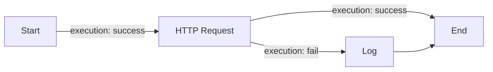

# SiyeFlow Workflow Schema

The definitive reference for the SiyeFlow workflow JSON. Companion docs: [PROGRESS.md](PROGRESS.md), [root README](../README.md).

Source of truth: [`src/siye-flow-designer/src/models/workflow-models.ts`](../src/siye-flow-designer/src/models/workflow-models.ts).

---

## Part 1 — Mental model

SiyeFlow uses a **node-edge graph**:

- **Nodes** are typed blocks with type-specific `data`.
- **Edges** either route execution (`type: "execution"`) or wire data between nodes (`type: "data"`).
- Each edge connects a `sourceHandle` (port) on one node to a `targetHandle` on another.



## Part 2 — Top-level shape

```json
{
  "id": "wf-123",
  "name": "My Workflow",
  "description": "Optional human description",
  "version": "2.0.0",
  "meta": { "anything": "you want" },
  "nodes": [ /* Node[] */ ],
  "edges": [ /* Edge[] */ ]
}
```

### Node

```ts
interface Node {
    id: string;                  // unique within the workflow
    type: BlockType;             // see Block catalog below
    label?: string;              // UI label
    data: Record<string, unknown>; // block-specific config
    interface?: NodeInterface;   // optional custom port definitions
}
```

### Edge

```ts
interface Edge {
    id: string;
    type: 'execution' | 'data';
    source: string;       // node id
    sourceHandle: string; // port name on source
    target: string;
    targetHandle: string;
}
```

### BlockType enum

`start`, `end`, `variable`, `evaluate`, `log`, `http-request`, `webhook-trigger`, `switch`, `loop`, `delay`, `batch-process`, `sub-workflow`, `condition`.

> `webhook-trigger` exists in the enum but is not currently surfaced in the designer palette.

## Part 3 — Block catalog

### Start
Entry point. Defines inputs and environment profiles.
- **Ports:** output `trigger`, plus one output per input variable.

```json
{
    "id": "start_1",
    "type": "start",
    "data": {
        "inputs": {
            "apiUrl":   { "type": "string", "required": true },
            "userId":   { "type": "string", "required": false }
        },
        "profiles": [
            { "name": "Dev",  "values": { "apiUrl": "http://localhost:5216" } },
            { "name": "Prod", "values": { "apiUrl": "https://api.example.com" } }
        ]
    }
}
```

### End
Exit point. Returns the final response.
- **Ports:** input `trigger`.

```json
{ "id": "end_1", "type": "end", "data": { "outputs": { "fact": "{{catFact}}" } } }
```

### HTTP Request
Makes a REST call. Branches on the response status.
- **Ports:** input `trigger`; outputs `success`, `fail`.
- **`outputs`** is a map of *variable name → JSONPath*.

```json
{
    "id": "http_1",
    "type": "http-request",
    "data": {
        "method": "GET",
        "url": "{{apiUrl}}/api/users/{{userId}}",
        "headers": { "Authorization": "Bearer {{token}}" },
        "outputs": {
            "userName": "$.name",
            "email":    "$.email"
        }
    }
}
```

### Condition
Boolean branch.
- **Ports:** input `trigger`; outputs `success` (true) and `fail` (false).

```json
{
    "id": "cond_1",
    "type": "condition",
    "data": { "expression": "{{statusCode}} == 200" }
}
```

### Switch
Multi-branch on a value.
- **Ports:** input `trigger`; one dynamic output per case.

```json
{
    "id": "switch_1",
    "type": "switch",
    "data": {
        "expression": "{{statusCode}}",
        "cases": [
            { "id": "ok",  "value": 200, "label": "OK" },
            { "id": "err", "value": 500, "label": "Server error" }
        ]
    }
}
```

### Loop
Iterates a collection. Exposes `loopIndex`, `loopItem`, `loopCount` to the body.
- **Ports:** input `trigger`; outputs `each` (per iteration) and `done`.

```json
{
    "id": "loop_1",
    "type": "loop",
    "data": { "items": "{{users}}" }
}
```

### Variable
Reads from / writes to the global variable store.
- **Ports:** input `trigger`; output `out`.

```json
{
    "id": "var_1",
    "type": "variable",
    "data": { "set": { "greeting": "Hello {{userName}}" } }
}
```

### Evaluate
Runs a sandboxed expression and stores the result.
- **Ports:** input `trigger`; output `out`.

```json
{
    "id": "eval_1",
    "type": "evaluate",
    "data": {
        "language": "jsonpath",
        "expressions": { "total": "$.items[*].price" }
    }
}
```

### Log
Writes to the terminal panel.
- **Ports:** input `trigger`; output `out`.

```json
{
    "id": "log_1",
    "type": "log",
    "data": { "level": "info", "message": "Got {{userName}}" }
}
```

### Delay
Pauses execution.
- **Ports:** input `trigger`; output `out`.

```json
{ "id": "delay_1", "type": "delay", "data": { "duration": 2, "unit": "seconds" } }
```

### Batch
Processes a list in parallel.
- **Ports:** input `trigger`; outputs `item` (per item) and `completed` (when all done).

```json
{ "id": "batch_1", "type": "batch-process", "data": { "items": "{{users}}", "maxConcurrency": 5 } }
```

### Sub-Workflow
Invokes a nested workflow. Stub today — see [PROGRESS.md](PROGRESS.md).
- **Ports:** input `trigger`; outputs `success`, `fail`.

## Part 4 — Variables and expressions

### Interpolation
- `{{name}}` — top-level variable
- `{{user.email}}` — nested property
- `{{users[0].id}}` — array index

Built-ins:
- `{{$timestamp}}`, `{{$workflowId}}`
- Inside loops: `{{$loopIndex}}`, `{{$loopItem}}`, `{{$loopCount}}`
- Inside catch / fail paths: `{{$error}}`

### JSONPath
Used in HTTP block `outputs` and in Evaluate blocks with `language: "jsonpath"`. Standard syntax (`$.field`, `$.items[*]`, `$.items[0]`).

## Part 5 — Runtime behavior

1. Engine finds the node with `type: "start"` and walks **execution edges** breadth-first.
2. Before running a node, **data edges** targeting it inject values into its `data` config (and into the variable store).
3. Each block returns the name of the next outgoing handle (e.g. `success`, `fail`, a case id). The engine continues along execution edges with that `sourceHandle`.
4. The browser executor in [`siye-flow-designer/src/core/browser-workflow-executor.ts`](../src/siye-flow-designer/src/core/browser-workflow-executor.ts) supports breakpoints, pause/resume/step, and live variable inspection. The .NET CLI executor (`src/SiyeFlow.CLI/Services/`) is the same model but partial — see [PROGRESS.md](PROGRESS.md).

## Part 6 — Migration note

Older workflows used `connections` inline on each block. v2.0 splits them into a top-level `edges` array — `WorkflowEngine.migrateLegacyWorkflow` in [`workflow-engine.ts`](../src/siye-flow-designer/src/core/workflow-engine.ts) upgrades legacy JSON on import. Save once after import to persist the new shape.
